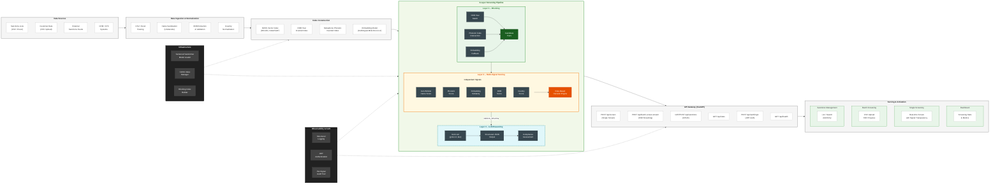

```mermaid
%%{init: {'theme': 'base', 'themeVariables': { 'fontSize': '13px', 'fontFamily': 'Segoe UI, Arial', 'primaryColor': '#ffffff', 'lineColor': '#444' }}}%%

graph LR

%% ============================================================
%% LAYER: DATA SOURCES
%% ============================================================
subgraph SOURCES["<b>Data Sources</b>"]
    direction TB
    S1["Sanctions Lists\n(CSV / Excel)"]
    S2["Customer Data\n(CSV Upload)"]
    S3["External\nSanctions Feeds"]
    S4["CRM / KYC\nSystems"]
end

%% ============================================================
%% LAYER: DATA INGESTION & NORMALIZATION
%% ============================================================
subgraph INGEST["<b>Data Ingestion & Normalization</b>"]
    direction TB
    I1["CSV / Excel\nParsing"]
    I2["Name Sanitization\n(Unidecode)"]
    I3["DOB Extraction\n& Validation"]
    I4["Country\nNormalization"]
end

%% ============================================================
%% LAYER: INDEX CONSTRUCTION
%% ============================================================
subgraph INDEX["<b>Index Construction</b>"]
    direction TB
    X1["FAISS Vector Index\n(384-dim, IndexFlatIP)"]
    X2["DOB Year\nInverted Index"]
    X3["Metaphone Phonetic\nInverted Index"]
    X4["Embedding Model\n(multilingual-MiniLM-L12-v2)"]
end

%% ============================================================
%% LAYER: 3-LAYER SCREENING PIPELINE
%% ============================================================
subgraph PIPELINE["<b>3-Layer Screening Pipeline</b>"]
    direction TB

    subgraph L1["<b>Layer 1 -- Blocking</b>"]
        direction LR
        L1A["DOB Year\nMatch"]
        L1B["Phonetic Code\nIntersection"]
        L1C["Embedding\nFallback"]
        L1D["Candidate\nPairs"]
        L1A --> L1D
        L1B --> L1D
        L1C --> L1D
    end

    subgraph L2["<b>Layer 2 -- Multi-Signal Scoring</b>"]
        direction LR
        subgraph SIGNALS["Independent Signals"]
            direction TB
            L2A["Jaro-Winkler\nName Score"]
            L2B["Phonetic\nScore"]
            L2C["Embedding\nSimilarity"]
            L2D["DOB\nScore"]
            L2E["Country\nScore"]
        end
        L2F["Rule-Based\nDecision Engine"]
        SIGNALS --> L2F
    end

    subgraph L3["<b>Layer 3 -- LLM Reasoning</b>"]
        direction LR
        L3A["Grok xAI\n(grok-4-1-fast)"]
        L3B["Structured JSON\nOutput"]
        L3C["Compliance\nAssessment"]
        L3A --> L3B --> L3C
    end

    L1 --> L2
    L2 -->|"NEEDS_REVIEW"| L3
end

%% ============================================================
%% LAYER: API GATEWAY
%% ============================================================
subgraph API["<b>API Gateway (FastAPI)</b>"]
    direction TB
    A1["POST /api/screen\n(Single Screen)"]
    A2["POST /api/batch-screen-stream\n(SSE Streaming)"]
    A3["GET/POST /api/sanctions\n(CRUD)"]
    A4["GET /api/stats"]
    A5["POST /api/auth/login\n(JWT Auth)"]
    A6["GET /api/health"]
end

%% ============================================================
%% LAYER: SERVING & ACTIVATION (FRONTEND)
%% ============================================================
subgraph SERVE["<b>Serving & Activation</b>"]
    direction TB
    subgraph UI1["Dashboard"]
        F1["Screening Stats\n& Metrics"]
    end
    subgraph UI2["Single Screening"]
        F2["Real-time Screen\nwith Signal Transparency"]
    end
    subgraph UI3["Batch Screening"]
        F3["CSV Upload\nSSE Progress"]
    end
    subgraph UI4["Sanctions Management"]
        F4["List / Search\nAdd Entry"]
    end
end

%% ============================================================
%% CROSS-CUTTING: INFRASTRUCTURE
%% ============================================================
subgraph INFRA["<b>Infrastructure</b>"]
    direction LR
    INF1["SentenceTransformer\nModel Loader"]
    INF2["FAISS Index\nManager"]
    INF3["Blocking Index\nBuilder"]
end

subgraph OBS["<b>Observability & Auth</b>"]
    direction LR
    OB1["Structured\nLogging"]
    OB2["JWT\nAuthentication"]
    OB3["Per-Signal\nAudit Trail"]
end

%% ============================================================
%% CONNECTIONS
%% ============================================================
SOURCES --> INGEST
INGEST --> INDEX
INDEX --> PIPELINE
PIPELINE --> API
API --> SERVE

%% Cross-cutting
INFRA -.-> INDEX
INFRA -.-> PIPELINE
OBS -.-> API
OBS -.-> PIPELINE

%% ============================================================
%% STYLING
%% ============================================================

%% Data Sources - Light Gray
style SOURCES fill:#f5f5f5,stroke:#9e9e9e,stroke-width:2px,color:#212121
style S1 fill:#ffffff,stroke:#bdbdbd,color:#333
style S2 fill:#ffffff,stroke:#bdbdbd,color:#333
style S3 fill:#ffffff,stroke:#bdbdbd,color:#333
style S4 fill:#ffffff,stroke:#bdbdbd,color:#333

%% Ingestion - Light Gray
style INGEST fill:#f5f5f5,stroke:#9e9e9e,stroke-width:2px,color:#212121
style I1 fill:#ffffff,stroke:#bdbdbd,color:#333
style I2 fill:#ffffff,stroke:#bdbdbd,color:#333
style I3 fill:#ffffff,stroke:#bdbdbd,color:#333
style I4 fill:#ffffff,stroke:#bdbdbd,color:#333

%% Index - Light Gray
style INDEX fill:#f5f5f5,stroke:#9e9e9e,stroke-width:2px,color:#212121
style X1 fill:#ffffff,stroke:#bdbdbd,color:#333
style X2 fill:#ffffff,stroke:#bdbdbd,color:#333
style X3 fill:#ffffff,stroke:#bdbdbd,color:#333
style X4 fill:#ffffff,stroke:#bdbdbd,color:#333

%% Pipeline main - Green border
style PIPELINE fill:#f1f8e9,stroke:#43a047,stroke-width:2px,color:#1b5e20

%% Layer 1 - Green
style L1 fill:#e8f5e9,stroke:#43a047,stroke-width:2px,color:#2e7d32
style L1A fill:#37474f,stroke:#263238,color:#ffffff
style L1B fill:#37474f,stroke:#263238,color:#ffffff
style L1C fill:#37474f,stroke:#263238,color:#ffffff
style L1D fill:#1b5e20,stroke:#0d3b12,color:#ffffff

%% Layer 2 - Amber
style L2 fill:#fff8e1,stroke:#f57f17,stroke-width:2px,color:#e65100
style SIGNALS fill:transparent,stroke:none
style L2A fill:#37474f,stroke:#263238,color:#ffffff
style L2B fill:#37474f,stroke:#263238,color:#ffffff
style L2C fill:#37474f,stroke:#263238,color:#ffffff
style L2D fill:#37474f,stroke:#263238,color:#ffffff
style L2E fill:#37474f,stroke:#263238,color:#ffffff
style L2F fill:#e65100,stroke:#bf360c,color:#ffffff

%% Layer 3 - Cyan/Teal dashed
style L3 fill:#e0f7fa,stroke:#00838f,stroke-width:2px,stroke-dasharray:5 5,color:#006064
style L3A fill:#37474f,stroke:#263238,color:#ffffff
style L3B fill:#37474f,stroke:#263238,color:#ffffff
style L3C fill:#37474f,stroke:#263238,color:#ffffff

%% API Gateway
style API fill:#f5f5f5,stroke:#9e9e9e,stroke-width:2px,color:#212121
style A1 fill:#ffffff,stroke:#bdbdbd,color:#333
style A2 fill:#ffffff,stroke:#bdbdbd,color:#333
style A3 fill:#ffffff,stroke:#bdbdbd,color:#333
style A4 fill:#ffffff,stroke:#bdbdbd,color:#333
style A5 fill:#ffffff,stroke:#bdbdbd,color:#333
style A6 fill:#ffffff,stroke:#bdbdbd,color:#333

%% Serving - Green boxes
style SERVE fill:#f5f5f5,stroke:#9e9e9e,stroke-width:2px,color:#212121
style UI1 fill:#e8f5e9,stroke:#43a047,stroke-width:1px,color:#333
style UI2 fill:#e8f5e9,stroke:#43a047,stroke-width:1px,color:#333
style UI3 fill:#e8f5e9,stroke:#43a047,stroke-width:1px,color:#333
style UI4 fill:#e8f5e9,stroke:#43a047,stroke-width:1px,color:#333
style F1 fill:#ffffff,stroke:#bdbdbd,color:#333
style F2 fill:#ffffff,stroke:#bdbdbd,color:#333
style F3 fill:#ffffff,stroke:#bdbdbd,color:#333
style F4 fill:#ffffff,stroke:#bdbdbd,color:#333

%% Infrastructure - Dark
style INFRA fill:#212121,stroke:#000000,stroke-width:2px,color:#ffffff
style INF1 fill:#424242,stroke:#616161,color:#ffffff
style INF2 fill:#424242,stroke:#616161,color:#ffffff
style INF3 fill:#424242,stroke:#616161,color:#ffffff

%% Observability - Dark
style OBS fill:#212121,stroke:#000000,stroke-width:2px,color:#ffffff
style OB1 fill:#424242,stroke:#616161,color:#ffffff
style OB2 fill:#424242,stroke:#616161,color:#ffffff
style OB3 fill:#424242,stroke:#616161,color:#ffffff
```
